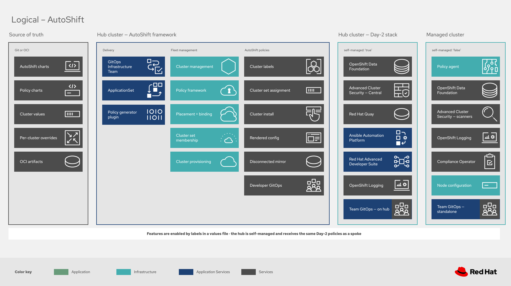
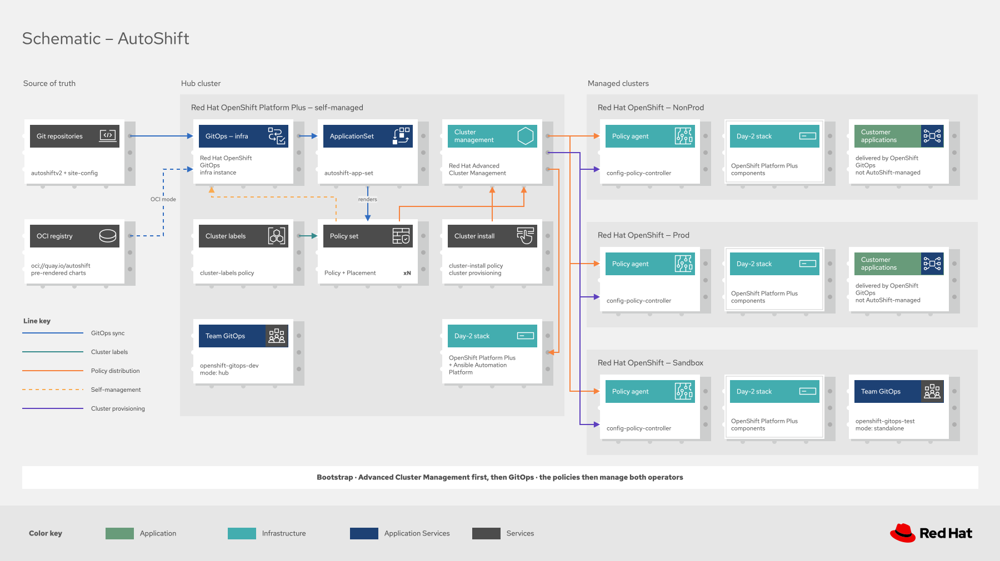
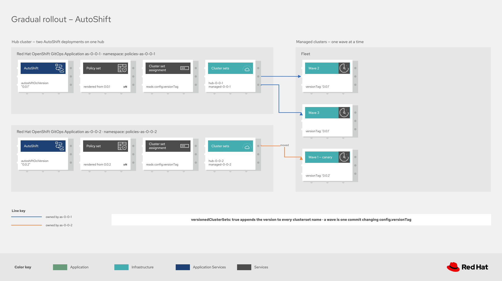

# Architecture

AutoShift introduces no control plane of its own. It is a composition of two Red Hat products:
[Red Hat OpenShift GitOps](https://docs.redhat.com/en/documentation/red_hat_openshift_gitops)
declaratively manages
[Red Hat Advanced Cluster Management for Kubernetes](https://docs.redhat.com/en/documentation/red_hat_advanced_cluster_management_for_kubernetes),
which in turn manages the fleet. Everything AutoShift adds is Helm charts, policies, and a values
file convention on top of that pair.

Understanding the architecture therefore means understanding four things: what runs where, how
configuration reaches a cluster, how a cluster is selected, and how the model scales out.

> [!TIP]
> The diagrams are wide and dense. Select any image to open it at full size.

## The platform underneath

Two product architectures do the actual work.

**Red Hat Advanced Cluster Management** supplies the hub and managed cluster model. A hub cluster
runs the central controllers. Every other cluster runs a klusterlet agent registered to exactly
one hub, which is the constraint that shapes the hub-of-hubs topology described later on this
page. See
[Multicluster architecture](https://docs.redhat.com/en/documentation/red_hat_advanced_cluster_management_for_kubernetes/2.17/html/about/welcome-to-red-hat-advanced-cluster-management-for-kubernetes#multicluster-architecture).

Its governance policy framework is what distributes AutoShift's policies. A policy propagator on
the hub creates a replicated policy in each managed cluster namespace, and a configuration policy
controller on the managed cluster enforces it and reports compliance back. Reading
[Governance policy framework architecture](https://docs.redhat.com/en/documentation/red_hat_advanced_cluster_management_for_kubernetes/2.17/html/governance/governance-architecture)
is worthwhile before treating any AutoShift policy behavior as unexpected, because most of what
looks like AutoShift is this framework.

**Red Hat OpenShift GitOps** supplies Argo CD. AutoShift runs its own infrastructure instance
rather than the operator's default one, and uses an ApplicationSet to turn a directory of policy
charts into one Application each.

## What runs where

The source of truth sits in Git or an Open Container Initiative (OCI) registry. The hub cluster
runs the AutoShift framework: the GitOps delivery chain, the Advanced Cluster Management fleet
services, and AutoShift's own policies. Managed clusters run a policy agent and whatever Day 2
stack their labels select.

The column that surprises most readers is the hub's own Day 2 stack. The hub is self-managed, so
it receives the same Day 2 policies as any spoke. It is not a bare control plane.

## How configuration reaches a cluster

Deployment happens in three phases. Advanced Cluster Management and OpenShift GitOps are
installed with Helm, an Argo CD Application is created for the `autoshift` chart, and the
ApplicationSet then discovers every directory under `policies/` and deploys each as its own
Application. Ordering matters in the first phase: Advanced Cluster Management must be installed
first, because the GitOps repository server resolves its policy generator sidecar image from an
Advanced Cluster Management deployment.

After the fan-out, the framework manages itself. The `openshift-gitops` and
`advanced-cluster-management` policies take over the two operators that were installed by hand,
which is the dashed self-management line in the diagram that follows.

Two delivery modes exist. A source install renders charts through the policy generator plugin. An
OCI install consumes pre-rendered charts published to a registry and involves no plugin. See
[Releases and OCI](releases.md).

## How a cluster is selected

Labels are the control plane, and they are the mechanism everything else rests on. A value in a
values file becomes a ConfigMap, then a label on a `ManagedCluster`, then a `PlacementDecision`,
then a policy on that cluster. No feature label is ever applied to a `ManagedCluster` by hand.

Configuration that does not fit in a label goes in a `config:` block instead, which AutoShift
renders into a ConfigMap that policies read through hub templates. Both paths are covered in
[Config and labels](config-and-labels.md), and every available label and config key is listed in the
[Values reference](values-reference.md).

## Scaling the fleet

Both of the following reduce to the same primitive: which cluster set a cluster belongs to.

### Gradual rollout

Two AutoShift deployments run side by side on one hub, each owning its own versioned cluster
sets. A wave is one commit that changes `config.versionTag` for a set of clusters, moving them
from one deployment to the other. Covered in full in [Gradual rollout](gradual-rollout.md).

### Hub-of-hubs

Hubs stack. A global hub manages other hubs, each running its own AutoShift instance. The single
Advanced Cluster Management constraint noted earlier shapes the whole topology: because a cluster
is managed by exactly one hub, a spoke hub cannot manage itself, so everything that must run on
it is placed from the layer that follows. Covered in full in
[Hub-of-hubs topology](hub-of-hubs.md).

## Delivering into a disconnected site

AutoShift ships the same content two ways. A connected hub pulls charts straight from the registry.
A disconnected site never reaches the internet, so a release is assembled on a connected machine,
mirrored, and carried across the boundary as files. Everything on the low side then resolves against
the internal registry, and the policies behave identically once the images and charts are present.
The mirroring workflow is documented in
[Releases and OCI](releases.md#disconnected-air-gapped-environments).

## Where to go next

- [Quick start](quickstart.md) to install
- [Values reference](values-reference.md) for every label and config key
- [Provisioning clusters](cluster-install.md) for creating clusters from the same values files
- [Developer guide](developer-guide.md) for adding a policy
