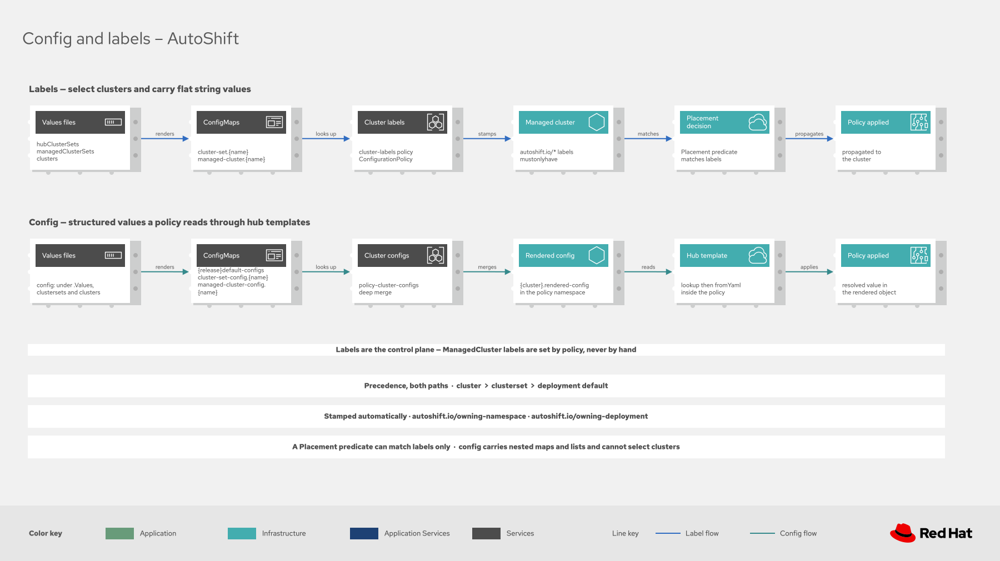

# Config and labels

AutoShift carries two kinds of per-cluster data from values files to policies: **labels** and
**config**. They travel separate paths, land in different places, and are read differently inside a
policy. Choosing the wrong one is the most common mistake when writing a first policy, because both
start in the same values file and look interchangeable there.

Neither is ever set by hand on a cluster. Both are declared in values files and propagated by
policy.

## Choosing between them

Use a label when the value selects clusters or is a single short string. Use config for anything
structured.

| | Labels | Config |
|---|---|---|
| Declared under | `labels:` | `config:` |
| Lands on | The `ManagedCluster` object | A `{cluster}.rendered-config` ConfigMap |
| Shape | Flat strings only | Nested maps and lists |
| Size limit | 63 characters, restricted character set | None in practice |
| Selects clusters | Yes, through a Placement predicate | No |
| Read in a policy through | `index .ManagedClusterLabels` | `lookup` of the rendered-config ConfigMap |
| Visible in the console | Yes, on the cluster | No, only in the ConfigMap |

The decisive question is whether a Placement needs the value. A Placement predicate can match only
labels, so every feature toggle (`autoshift.io/<component>: 'true'`) is a label. A storage class
name or an operator channel is also a label, because it is one short string. A list of network bonds,
a set of node roles, or an install specification is config, because a label cannot hold it.

> [!NOTE]
> A label value cannot contain a slash, a space, or more than 63 characters, and must start and end
> with an alphanumeric character. An image reference or a certificate does not fit, so those are
> always config.

## How each reaches a cluster

[](diagrams/autoshift-config-and-labels.drawio.svg)

Both paths share a shape: values files render ConfigMaps on the hub, a policy reads those ConfigMaps
and produces the resolved result, and other policies consume that result.

### The label path

1. Labels are declared under `hubClusterSets`, `managedClusterSets`, or `clusters` in the values
   files.
2. The `cluster-labels` Application renders them into ConfigMaps named `cluster-set.{name}` and
   `managed-cluster.{name}`, each carrying the label `autoshift.io/cluster-labels`.
3. The `cluster-labels` policy looks those ConfigMaps up at run time and stamps the resolved set onto
   each `ManagedCluster` with `mustonlyhave`, so an `autoshift.io/*` label that is no longer declared
   is removed.
4. Placement predicates match the stamped labels, which decides where each policy lands.

### The config path

1. Config is declared under `config:` at three levels: `.Values.config` for the whole deployment,
   `hubClusterSets.<name>.config` or `managedClusterSets.<name>.config` for a clusterset, and
   `clusters.<name>.config` for one cluster.
2. The `cluster-config-maps` Application renders one ConfigMap per level: `{release}default-configs`,
   `cluster-set-config.{name}`, and `managed-cluster-config.{name}`.
3. The `policy-cluster-configs` policy reads all three by label selector, deep merges them, and
   writes one `{cluster}.rendered-config` ConfigMap per cluster, carrying the label
   `autoshift.io/rendered-config-map`.
4. Policies read that ConfigMap through a hub template.

Precedence is the same on both paths: cluster beats clusterset, and clusterset beats the fleet
default. The merge is deep, so a clusterset can set `config.networking.mtu` and a single cluster can
override only `config.networking.gateway` without restating the rest.

## Reading values in a policy

### Reading a label

Labels are available directly in a hub template as `.ManagedClusterLabels`. Always supply a default,
because a cluster that does not set the label still evaluates the template.

```yaml
channel: '{{hub index .ManagedClusterLabels "autoshift.io/<component>-channel" | default "stable" hub}}'
```

For a Placement, match the label instead of reading it:

```yaml
predicates:
  - requiredClusterSelector:
      labelSelector:
        matchExpressions:
          - key: autoshift.io/<component>
            operator: In
            values: ['true']
```

### Reading config

Config requires looking up the cluster's rendered-config ConfigMap and parsing the YAML it holds.
The following chain is the established form, and it is nil safe at every step:

```yaml
{{hub- $cm := (lookup "v1" "ConfigMap" .PolicyMetadata.namespace (printf "%s.rendered-config" .ManagedClusterName)) | default dict hub}}
{{hub- $config := (index ($cm | default dict) "data" | default dict) hub}}
{{hub- $configYaml := (index $config "config" | default "" | fromYaml | default dict) hub}}
{{hub- $component := (index $configYaml "<component>" | default dict) hub}}
{{hub- $setting := (index $component "<setting>" | default "<fallback>") hub}}
```

Each `| default` matters. `lookup` returns nil when the ConfigMap is absent, and indexing into nil
panics, which fails the whole policy rather than the one field.

## Best practices

**Give every read a default.** A policy is rendered against clusters that do not set the value. A
missing default produces `<no value>` in the output, which the validation suite treats as a failure.

**Do not use `default` for a numeric zero or a false boolean.** The Sprig `default` function treats
`0` and `false` as empty and replaces them. Guard with `hasKey` when zero is a legitimate value.

**Keep related settings under one config key.** A policy that owns its settings should read a single
top-level key named after the component, so `workload-partitioning` reads `config.workloadPartitioning`.
Shared facts that several policies need, such as `networking`, `hosts`, and `disconnected`, are
top-level keys of their own rather than being duplicated per component.

**Never put credentials in config.** Config becomes a ConfigMap, which is not a secret. Reference a
Secret that an administrator creates on the cluster instead.

**Declare everything in the example values.** Every label and every config key a policy reads must
appear in `autoshift/values/clustersets/_example.yaml`. That file is the catalog, and the validation
suite fails on a key that a policy consumes but nothing declares. The curated profiles such as
`hub.yaml` are deliberate subsets and do not satisfy the contract.

## Naming

A component named `<component>` in `policies/` takes these names:

| Thing | Name |
|---|---|
| Enable label | `autoshift.io/<component>` |
| Operator labels | `autoshift.io/<component>-channel`, `-subscription-name`, `-source`, `-source-namespace`, `-version` |
| Config key | `<component>` in lowerCamelCase, so `workload-partitioning` becomes `workloadPartitioning` |

A component may instead read a shared config key when the setting genuinely belongs to the fleet
rather than to that component. Those keys are listed in `.github/config-key-conventions.yaml`, and
anything else that deviates has to be recorded there as well, which keeps each exception visible in
review.

## Validation

Run the suite before committing:

```bash
cd tools && go test -tags integration ./...
```

It renders every chart, resolves hub and spoke templates, and checks two contracts:

- **Label contract**: every `autoshift.io/*` label a policy consumes is declared in an example values
  file. A label that is consumed but not declared fails. A label that is declared but unused warns.
- **Config key conventions**: every config key declared in an example values file resolves to a policy
  directory in lowerCamelCase, or is recorded as a shared key or an alias. A key that resolves to
  nothing is configuration users can set that no policy reads.

Known and intentional deviations are recorded in `.github/label-lint-allowlist.yaml` and
`.github/config-key-conventions.yaml`.
