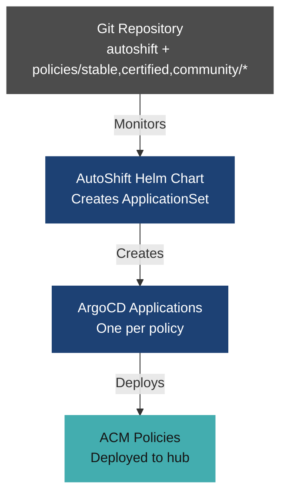
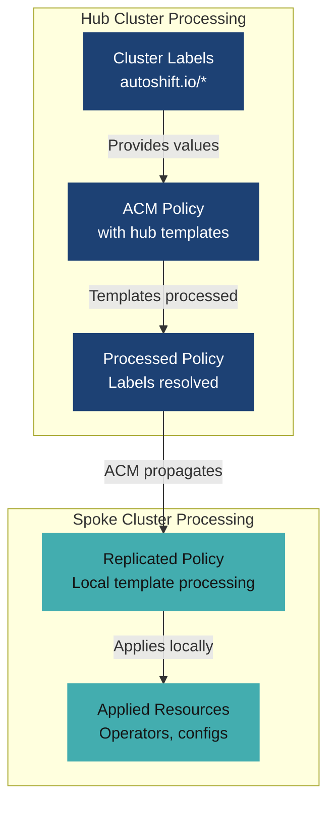
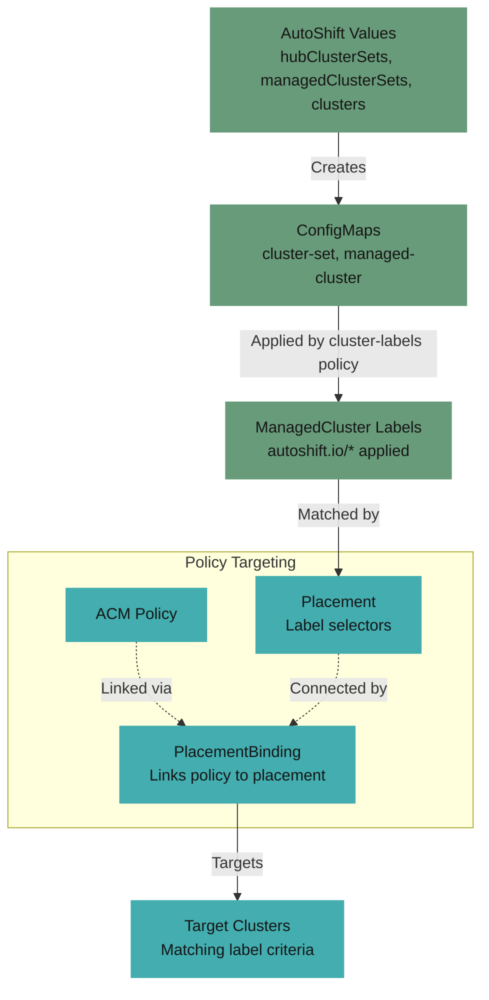
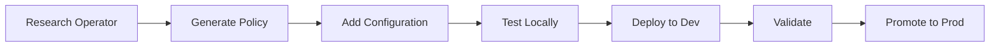

# AutoShiftv2 - developer guide

**Build and manage OpenShift Platform Plus infrastructure as code with policy-driven automation**

## 🚀 Quick start - create your first policy

Generate and deploy an operator policy in under 5 minutes:

```bash
# 1. Generate a new operator policy with AutoShift integration and version pinning
./scripts/generate-operator-policy.sh my-component my-operator-package --channel stable --namespace my-component --version my-operator.v1.0.0 --add-to-autoshift

# 2. Validate the generated policy renders and resolves
(cd tools && go test -tags integration ./internal/resolver/...)

# 3. Commit and push - AutoShift will automatically deploy via GitOps
git add policies/stable/my-component/
git commit -m "Add my-component operator policy"
git push origin main  # or your branch if contributing
```

Your operator is now being deployed across your clusters. Check the ArgoCD dashboard to monitor progress.

## 📋 Table of contents

- [Architecture Overview](#architecture-overview)
- [Developer Setup](#developer-setup)
- [Creating Your First Policy](#creating-your-first-policy)
- [Policy Development Guide](#policy-development-guide)
- [Common Development Tasks](#common-development-tasks)
- [Testing and Validation](#testing-and-validation)
- [Contributing](#contributing)
- [Troubleshooting](#troubleshooting)
- [Additional Resources](#additional-resources)

## 🏗️ Architecture overview

AutoShiftv2 orchestrates OpenShift infrastructure through a sophisticated GitOps and policy-driven architecture:

### 1. GitOps flow: source to deployment



### 2. Policy processing: hub templates to spoke deployment



### 3. Cluster targeting: label-based policy distribution



**Key Components and Flow:**

1. **GitOps Foundation**: ArgoCD ApplicationSet monitors `policies/{stable,certified,community}/*` directories in Git repository
2. **Dynamic Application Creation**: ApplicationSet creates individual ArgoCD Applications for each policy
3. **Policy Rendering**: Each Application renders a PolicyGenerator dir through the repo-server `ConfigManagementPlugin` (CMP) (or a Helm chart for the few holdouts), producing a Red Hat Advanced Cluster Management Policy + Placement + `PlacementBinding`
4. **Hub Template Processing**: Red Hat Advanced Cluster Management processes hub templates on the hub cluster, resolving per-cluster values before replication
5. **Policy Propagation**: Red Hat Advanced Cluster Management Policy Framework propagates processed policies to target spoke clusters
6. **Spoke Template Processing**: Policy agents on spoke clusters process any remaining regular templates with local cluster context
7. **Resource Application**: Final Kubernetes resources are applied on spoke clusters

**Two Configuration Patterns:**

- **Label-based** (operator policies): Labels defined in values files are propagated to `ManagedClusters` by the `cluster-labels` policy. Hub templates read labels through `{{hub index .ManagedClusterLabels "autoshift.io/key" hub}}` to configure operator subscriptions, channels, etc.
- **Config-based** (nmstate, cluster-install): Structured YAML config defined in values files is merged by the `cluster-config-maps` policy into rendered-config ConfigMaps. Hub templates read these ConfigMaps through `lookup` + `fromYaml` to generate complex resources like NNCPs and `NMStateConfigs`.

**Cluster Targeting:**
- **Placement matching**: Selects target clusters by using label expressions and cluster sets
- **Dynamic behavior**: Same policy template produces different resources per cluster based on labels or config

## 🛠️ Developer setup

### Prerequisites

None of these are vendored in the repository. Until they are present, the validation suite and the
documentation checks cannot run.

| Tool | Version | Needed for | Installation |
|------|---------|------------|-------------|
| Git | 2.x or later | Everything | Pre-installed on most systems |
| Helm | 3.x | Rendering charts, `make lint` | [Install Helm](https://helm.sh/docs/intro/install/) |
| Go | As declared in `tools/go.mod` | The validation suite, and installing kustomize | [Install Go](https://go.dev/doc/install) |
| kustomize and PolicyGenerator | kustomize v5.8.1 | Rendering any PolicyGenerator policy | `make install-policy-generator` |
| yq | Latest | Release tooling | `brew install yq` |
| gitleaks | 8.24.3 | The pre-commit secret scan | [Releases](https://github.com/gitleaks/gitleaks/releases) |
| Vale | 3.17.1 | The prose check | `brew install vale`, then `vale sync` |
| Zensical | Pinned in `docs/requirements.txt` | The documentation site build | `pip install -r docs/requirements.txt` |
| OpenShift CLI | Latest | Working against a live cluster | [Download oc](https://docs.redhat.com/en/documentation/openshift_container_platform/latest/html/cli_tools/openshift-cli-oc#installing-openshift-cli) |
| Access to a hub cluster | - | Deploying and debugging | Administrator or developer access |

Only Git, Helm, Go, and kustomize are needed to create a policy and validate it. The OpenShift CLI
and cluster access are needed to deploy one.

`make validate` checks for Helm, yq, and Git only, so a passing result does not mean the validation
suite can run. Confirm Go separately.

#### kustomize and the PolicyGenerator plugin

Most policies are PolicyGenerator directories, and rendering one needs both kustomize and the
PolicyGenerator plugin. Do not install these by hand. One target stages both into a repository-local
`.tools/` directory:

```bash
make install-policy-generator
```

The target uses `go install`, so Go has to be present first. The validation suite looks for
`$KUSTOMIZE_BIN` and `$KUSTOMIZE_PLUGIN_HOME`, and falls back to the repository-local `.tools/`
directory, so after running the target no environment variables are needed. Export them only when
kustomize lives somewhere else.

Without this step, the pre-commit hook prints a warning and every PolicyGenerator policy fails to
render.

Both versions are pinned in the `Makefile` and carry a `# renovate:` annotation, so Renovate raises
a pull request when a new release appears and continuous integration validates the bump before it
merges. Override either for a one-off test:

```bash
make install-policy-generator POLICY_GENERATOR_VERSION=<tag>
```

#### The devcontainer

The devcontainer in `.devcontainer/` carries the whole toolchain: Git, Helm, Go, yq, gitleaks, Vale,
Zensical, and the OpenShift CLI. Its `postCreateCommand` points `core.hooksPath` at `.githooks` and
runs `make install-policy-generator`, so the hooks and the plugin are ready on first open. Opening
the repository in the devcontainer is the shortest path to running every check the build runs.

The image builds with the repository root as its context, so it reads the Go version from
`tools/go.mod` and the Zensical version from `docs/requirements.txt` rather than pinning either a
second time. Vale itself is in the image, but the rule package is not: run `vale sync` once in the
workspace.

Outside the devcontainer, enable the hooks once:

```bash
git config core.hooksPath .githooks
```

#### Keeping versions current

Every version is pinned exactly, and a bot proposes each bump so that continuous integration
validates it before it merges. Nothing floats, because a floating version lands its breakage on an
unrelated pull request and blames the wrong change.

| What | Where the version lives | Updated by |
|---|---|---|
| Go module dependencies | `tools/go.mod` | Dependabot |
| GitHub Actions | `.github/workflows/` | Dependabot |
| Zensical | `docs/requirements.txt` | Dependabot |
| Helm, gitleaks, Vale | `# renovate:` annotations in the Containerfile, GitLab CI, and workflows | Renovate |
| kustomize, PolicyGenerator | `# renovate:` annotations in the `Makefile` | Renovate |
| Go in the devcontainer | derived from `tools/go.mod` | nothing to update |

Helm is pinned in four places: the devcontainer Containerfile, GitLab CI, and the two
`azure/setup-helm` steps in `.github/workflows/ci.yaml`. All four carry the same annotation, so they
move together. Dependabot bumps the action itself but never a `with:` input, which is why the two
workflow pins need the annotation.

> [!IMPORTANT]
> Helm and kustomize are compatibility pins, not currency pins. The Red Hat OpenShift GitOps
> repository server renders the charts that reach a cluster, so rendering locally with a different
> version is how local output starts diverging from the cluster. Match the versions that the
> deployed OpenShift GitOps ships:
>
> | OpenShift GitOps | Argo CD | Helm | Kustomize |
> |---|---|---|---|
> | 1.21 | 3.4.3 | 3.19.4 | 5.8.1 |
> | 1.20 | 3.3.2 | 3.19.4 | 5.8.1 |
> | 1.19 | 3.1.9 | 3.18.4 | 5.7.0 |
>
> `renovate.json` constrains both with `allowedVersions`, so Renovate proposes patches inside the
> current line and cannot raise Helm to 4. When `gitops-channel` moves, check the compatibility
> matrix in the OpenShift GitOps release notes, then update the pins and those ranges together.

Two versions are deliberately not pinned. `OCP_VERSION` is a release channel, so the OpenShift CLI
follows the latest patch, and the minor needs a manual bump. The Vale rule package resolves to the
latest `vale-at-red-hat` release on every `vale sync`, which is covered in
[Documentation style](documentation-style.md#getting-vale).

> [!IMPORTANT]
> The Renovate annotations only take effect when the Renovate GitHub App is installed on the
> repository. Dependabot is configured through `.github/dependabot.yml` and needs nothing further.

Every pull request runs the full build, because `.github/workflows/ci.yaml` triggers on any pull
request to `main` with no path filters. A bump proposed by either bot is therefore validated by
policy rendering, the label contract, the prose check, and the site build before it can merge.

When adding a version anywhere, put it in a manifest or give it a `# renovate:` annotation. A
version written inline in a workflow `run:` step is frozen forever, because neither bot reads one.

### Repository setup

```bash
# Clone the repository (or your fork if contributing)
git clone https://github.com/auto-shift/autoshiftv2.git
cd autoshiftv2

# Verify the policy generators work
./scripts/generate-operator-policy.sh --help
./scripts/generate-policy.sh --help

# Test operator policy generation
./scripts/generate-operator-policy.sh test-operator test-operator --channel stable --namespace test-operator
(cd tools && go test -tags integration ./internal/resolver/...)
rm -rf policies/stable/test-operator/

# Test configuration policy generation
./scripts/generate-policy.sh test-config --dir policies/stable/test-config --target both
(cd tools && go test -tags integration ./internal/resolver/...)
rm -rf policies/stable/test-config/
```

### First-time setup validation

```bash
# Check existing policies
ls -la policies/

# Validate ALL policies at once — renders every chart (PolicyGenerator dirs with a
# policy-generator-config.yaml AND the Helm holdouts with a Chart.yaml), resolves hub/spoke
# templates, and checks the label contract. This is the canonical validation:
make install-policy-generator          # one-time: stages kustomize + PG plugin into .tools/
cd tools && go test -tags integration -count=1 ./internal/resolver/... && cd ..
```

## 💡 Creating your first policy

### Step 1: research your operator

Before generating a policy, gather key information:

```bash
# Search for operator in OperatorHub
oc get packagemanifests -n openshift-marketplace | grep -i your-operator

# Get operator details
oc describe packagemanifest your-operator -n openshift-marketplace
```

### Step 2: generate the policy

```bash
# For cluster-scoped operators (most common)
./scripts/generate-operator-policy.sh \
  my-component \
  my-operator-subscription \
  --channel stable \
  --namespace my-component \
  --add-to-autoshift

# For namespace-scoped operators
./scripts/generate-operator-policy.sh \
  my-component \
  my-operator-subscription \
  --channel stable \
  --namespace my-component \
  --namespace-scoped \
  --add-to-autoshift
```

### Step 3: understand generated files

Your new policy directory (`policies/stable/my-component/`) is a Red Hat Advanced Cluster Management **PolicyGenerator** source:

```
policies/stable/my-component/
├── kustomization.yaml                  # Kustomize entrypoint
├── policy-generator-config.yaml        # PolicyGenerator (policy graph, remediation, eval interval)
├── placement.yaml                      # Placement predicate + tolerations
├── README.md                           # Policy documentation
├── manifests/                          # bare resources — PG wraps each into a ConfigurationPolicy
│   ├── namespace.yaml                  #   the operator Namespace (raw)
│   └── operator.yaml                   #   the OperatorPolicy (first-class; carries ${REMEDIATION})
└── test/                               # inform-only checks, added when you need to gate on state
```

`manifests` is a **directory** path in `policy-generator-config.yaml`, so a new file dropped into
it is picked up with no edit to that file. Edit `policy-generator-config.yaml` only to change the
policy graph itself: names, dependencies, placement, or per-policy remediation.

### Step 4: add operator configuration

Most operators need additional configuration after installation. Use the configuration policy generator to scaffold the template:

```bash
# 1. Explore installed CRDs
oc get crds | grep my-component

# 2. Generate a configuration policy (adds to existing policy directory)
./scripts/generate-policy.sh my-component-config \
  --dir policies/stable/my-component \
  --target both \
  --dependency my-component-operator-install

# 3. Edit the generated bare manifest - replace the placeholder ConfigMap with your actual resource
vi policies/stable/my-component/manifests/my-component-config.yaml
```

The generator drops a **bare** manifest under `manifests/` and adds a `policies[]` entry (with its
dependency and placement) to `policy-generator-config.yaml` — PolicyGenerator generates the
`ConfigurationPolicy` + Placement + `PlacementBinding` and injects `remediationAction`/`evaluationInterval`.
For a resource needing hub templates, loops, or conditionals, replace the placeholder with a bare
`object-templates-raw:` manifest. You can also generate standalone configuration policies in a new directory:

```bash
# Create a new policy directory for non-operator configuration
./scripts/generate-policy.sh my-cluster-config --dir policies/stable/my-cluster-config --target spoke

# Or use interactive mode to be guided through the options
./scripts/generate-policy.sh
```

See the `generate-policysh` section of `scripts/README.md` for all options including placement targets (`hub`, `spoke`, `both`, `all`) and dependency management.

### Step 5: test and deploy

```bash
# Validate your policy renders correctly (needs: make install-policy-generator)
KUSTOMIZE_PLUGIN_HOME=$PWD/.tools/kustomize-plugin .tools/kustomize build \
  --enable-alpha-plugins --enable-helm --load-restrictor LoadRestrictionsNone \
  policies/stable/my-component/
# Full validation (helm render + hub/spoke resolution + label contract):
cd tools && go test -tags integration -count=1 ./internal/resolver/... && cd ..

# Commit and push to deploy
git add policies/stable/my-component/
git commit -m "Add my-component operator with configuration"
git push

# Monitor deployment in ArgoCD
oc get applications.argoproj.io -n openshift-gitops | grep my-component
```

## 📚 Policy development guide

### Policy development workflow



### Working with hub template functions

AutoShiftv2 uses Red Hat Advanced Cluster Management hub templates to access cluster labels dynamically:

```yaml
# Access cluster labels for dynamic configuration
channel: '{{ "{{hub" }} index .ManagedClusterLabels "autoshift.io/my-component-channel" | default "stable" {{ "hub}}" }}'

# Conditional configuration based on labels
'{{ "{{hub" }} $clusterType := index .ManagedClusterLabels "autoshift.io/cluster-type" | default "development" {{ "hub}}" }}'
'{{ "{{hub" }} if eq $clusterType "production" {{ "hub}}" }}'
  replicas: 5
'{{ "{{hub" }} else {{ "hub}}" }}'
  replicas: 1
'{{ "{{hub" }} end {{ "hub}}" }}'

# Using subscription name from labels
name: '{{ "{{hub" }} index .ManagedClusterLabels "autoshift.io/my-component-subscription-name" | default "my-component-operator" {{ "hub}}" }}'
```

### Hub template pitfalls

#### Trim markers (`{{-` / `{{hub-`) — the indentation rule

**How `{{-` works:** It trims all whitespace (spaces, tabs, newlines) to the left of the template tag until it hits non-whitespace content.

**The critical rule:** Inside YAML block scalars (`|`), `{{-` template directives MUST be at the **same indentation level** as the content lines around them. If a `{{-` directive is at a shallower indent than the content above, the left-trim eats past the newline into the previous content line, merging two lines into one and producing invalid YAML.

```yaml
# WRONG — directive at 16 spaces, content at 20 spaces
# The {{- eats 4 extra spaces into the previous content line, merging the lines
                    spec:
                      imageSetRef:
                        name: {{ "{{" }} $imageSet {{ "}}" }}
                {{ "{{-" }} if $condition {{ "}}" }}
                      mirrorRegistryRef: ...
# Resolves to: "name: value      mirrorRegistryRef:" — broken YAML!

# CORRECT — directive aligned with content at 20 spaces
                    spec:
                      imageSetRef:
                        name: {{ "{{" }} $imageSet {{ "}}" }}
                    {{ "{{-" }} if $condition {{ "}}" }}
                      mirrorRegistryRef: ...
# Resolves to clean, separate lines
```

**Best practice:** Always use `{{-` for clean output. Just ensure the `{{-` directive is indented to match the surrounding content lines in the block scalar.

#### `toYaml` Requires `autoindent`

**Never use `toYaml` without `autoindent`** in `object-templates-raw`. Plain `toYaml` outputs at column 0, which terminates any enclosing YAML block scalar (`|`) and corrupts the document. `autoindent` detects the surrounding indentation level and preserves it.

```yaml
# WRONG — breaks out of the block scalar
{{ "{{" }} $myDict | toYaml {{ "}}" }}

# CORRECT — maintains indentation
{{ "{{" }} $myDict | toYaml | autoindent {{ "}}" }}
```

#### Comments in object-templates-raw

- `{{/* comment */}}` (Go-style, no trim) — **recommended**. Leaves a whitespace-only line that `{{-` trims naturally.
- `{{- /* */ -}}` (trim markers) — **dangerous**. Merges adjacent lines.
- `# YAML comment` — survives into output. Can merge with subsequent template lines.
- **Hub templates do NOT support comments.** `{{hub /* comment */ hub}}` is invalid and will cause a parse error. Only use Go-style comments (`{{/* */}}`) outside of `{{hub ... hub}}` delimiters.

#### Other gotchas

**`fromYaml`, `fromJson`, `toYaml`, `toJson` work in hub templates.** This enables reading structured data from ConfigMaps directly:

```yaml
{{ "{{hub-" }} $cm := (lookup "v1" "ConfigMap" $ns $name) {{ "hub}}" }}
{{ "{{hub-" }} $config := (index ($cm.data | default dict) "config" | default "" | fromYaml) {{ "hub}}" }}
```

**Read nested config with `dig`; hoist with `index` only when the intermediate is reused.** `dig` walks a path and returns its default when any level is missing, so a one-shot read is a single line:

```yaml
{{hub- $osImages := (dig "acm" "provisioning" "osImages" (list) $config) hub}}
```

Hoist a local with `index ... | default` when the same intermediate is read repeatedly, the way `$disconnected` and `$mirror` are in `acm-agentserviceconfig.yaml`. A hoist that is read once is ceremony. `dig` is available on every supported version, so it carries none of the allowlist risk described below. One difference is worth knowing: `dig` fails when an intermediate exists but is not a map, where `index | default` degrades quietly.

**The available Sprig functions depend on the Red Hat Advanced Cluster Management version.** Version 2.15 and earlier expose an explicit allowlist that omits `trimPrefix`, `trimSuffix`, `compact`, and `toString`. Version 2.16 and later expose the whole Sprig function map and deny only `env` and `expandenv`, so all four work.

Calling a function the hub does not have is not a local failure. It aborts hub resolution for the entire policy, so every `{{hub}}` expression stays raw, the wrapped policy is never created, and the operator silently never installs.

Where a deployment has to span hubs older than 2.16, prefer the portable form, which works on every version:

```yaml
# Portable on every version:
{{ "{{hub" }} $name := (replace "managed-cluster-config." "" $cmName) {{ "hub}}" }}
# Requires 2.16 or later:
{{ "{{hub" }} $name := (trimPrefix "managed-cluster-config." $cmName) {{ "hub}}" }}
```

The same applies to `compact`, where `ternary (list) (list $v) (empty $v)` is the portable form, and to `toString`, where `printf "%v" $v` is portable. For the full picture, see [Policy behavior at runtime](policy-behavior.md#template-engine-limits).

**`lookup` returns a Go map, not a string.** Use `| default dict` to safely handle missing resources:

```yaml
{{ "{{hub" }} $cm := (lookup "v1" "ConfigMap" $ns $name) | default dict {{ "hub}}" }}
{{ "{{hub" }} $data := (index $cm "data" | default dict) {{ "hub}}" }}
```

**Mixing hub and regular templates** is supported. Hub templates resolve first (on the hub), producing literal text. That text is then evaluated as a regular Go template on the managed cluster. This enables hub-side config injection combined with managed-cluster-side lookups.

The key pattern: a hub template can inject a value as a literal string, and a regular template on the spoke can use that string in a `lookup` or other expression. For example, the nmstate NNCP policy uses hub templates to read host config from the hub, then a regular template to look up the cluster's DNS domain on the spoke:

```yaml
object-templates-raw: |
  {{/*  Hub resolves this — reads config from rendered-config ConfigMap on the hub */}}
  {{ "{{hub" }} $cm := (lookup "v1" "ConfigMap" "policies-autoshift" (printf "%s.rendered-config" .ManagedClusterName)) {{ "hub}}" }}
  {{ "{{hub-" }} $config := (index ($cm.data | default dict) "config" | default "" | fromYaml) {{ "hub}}" }}
  {{ "{{hub-" }} $hosts := (index $config "hosts" | default dict) {{ "hub}}" }}
  {{/*  Spoke resolves this — looks up DNS config on the managed cluster */}}
  {{ "{{" }} $clusterDomain := ((lookup "config.openshift.io/v1" "DNS" "" "cluster").spec.baseDomain | default "") {{ "}}" }}
  {{/*  Hub injects the hostname string, spoke provides the domain */}}
  {{ "{{hub-" }} range $hostname, $host := $hosts {{ "hub}}" }}
      kubernetes.io/hostname: {{ "{{hub" }} $hostname {{ "hub}}" }}.{{ "{{" }} $clusterDomain {{ "}}" }}
  {{ "{{hub-" }} end {{ "hub}}" }}
```

After hub resolution for a cluster with `master-0` in its hosts, the spoke sees:

```yaml
  {{ "{{" }} $clusterDomain := ((lookup "config.openshift.io/v1" "DNS" "" "cluster").spec.baseDomain | default "") {{ "}}" }}
      kubernetes.io/hostname: master-0.{{ "{{" }} $clusterDomain {{ "}}" }}
```

The spoke then resolves `$clusterDomain` through its own DNS lookup, producing:

```yaml
      kubernetes.io/hostname: master-0.my-cluster.example.com
```

### Label-based configuration

Labels are configured in AutoShift values files and propagated to clusters by the cluster-labels policy:

```yaml
# In autoshift/values/clustersets/hub.yaml - configure labels for hub clusterset
hubClusterSets:
  hub:
    labels:
      my-component: 'true'
      my-component-subscription-name: 'my-component-operator'
      my-component-channel: 'stable'

# In autoshift/values/clustersets/managed.yaml - configure labels for managed clusterset
managedClusterSets:
  managed:
    labels:
      my-component: 'true'
      my-component-subscription-name: 'my-component-operator'
      my-component-channel: 'fast'
# Individual cluster overrides in autoshift/values/clusters/my-cluster.yaml
clusters:
  prod-cluster-1:
    labels:
      my-component-channel: 'stable-1.2'
```

Configuration precedence: **Individual Cluster > ClusterSet > Default Values**

### Dependency Management

A policy that requires another policy to be satisfied first declares it in the `dependencies` key
of its entry in `policy-generator-config.yaml`. PolicyGenerator fills in the API version, kind, and
namespace, so only the name is needed:

```yaml
policies:
  - name: policy-my-component-config
    dependencies:
      - name: policy-my-component-operator-install
    manifests:
      - path: manifests/config
```

A dependency blocks the dependent policy until the named policy reports Compliant. Add
`compliance: Compliant` when you want that state written out explicitly:

```yaml
    dependencies:
      - name: policy-infra-machineconfigpool
        compliance: Compliant
```

Two rules follow from this:

- **Depend on a policy, not on a resource.** To gate on something the cluster has to reach, such as
  an operator becoming ready, write an inform policy that checks for it and depend on that. See
  [Gating on cluster state](#gating-on-cluster-state).
- **Name the dependency exactly.** The value is the generated policy name, which is the `name`
  field of the other entry in `policies`, not the directory name and not the manifest file name.

Record the reasoning in the policy's `README.md` so the next reader knows why the order matters.

### Gating on cluster state

A check that only reports, and never changes anything, belongs in the policy directory's `test/`
subdirectory as its own policy with `remediationAction: inform`. Nineteen policy directories use
this pattern.

```
policies/stable/my-component/
├── policy-generator-config.yaml
├── manifests/                 # enforcing content
└── test/                      # inform-only checks, one file per assertion
    └── my-component-ready.yaml
```

```yaml
policies:
  - name: policy-my-component-test
    remediationAction: inform
    manifests:
      - path: test/my-component-ready.yaml
  - name: policy-my-component-config
    dependencies:
      - name: policy-my-component-test
    manifests:
      - path: manifests/config
```

> [!IMPORTANT]
> Do not bundle an inform-only check into an enforcing policy. A `remediationAction` set at the
> root of a policy overrides the setting on its children, so the check stops reporting and starts
> enforcing. That is why these live in a separate policy, and why `test/` is a separate directory
> rather than another file under `manifests/`.

## Deployment order

Placement decides which clusters get a policy. Dependencies decide the order in which they settle
on a given cluster. Neither is a global sequencer: policies are distributed in parallel, and a
dependency only holds back the policy that declares it.

## 🔧 Common Development Tasks

### Updating an Existing Policy

```bash
# 1. Make changes to the bare manifests (or policy-generator-config.yaml for the policy graph)
vi policies/stable/my-component/manifests/my-component-config.yaml

# 2. Validate changes
KUSTOMIZE_PLUGIN_HOME=$PWD/.tools/kustomize-plugin .tools/kustomize build \
  --enable-alpha-plugins --enable-helm --load-restrictor LoadRestrictionsNone \
  policies/stable/my-component/

# 3. Update with different label values
vi autoshift/values/clustersets/sbx.yaml
vi autoshift/values/clustersets/hub.yaml

# 4. Commit and deploy
git add policies/stable/my-component/
git add autoshift/
git commit -m "Update my-component configuration"
git push

# 5. Validate on sandbox cluster that is pointing to your branch

```

### Debugging Policy Issues

```bash
# Check policy status
oc get policies -A | grep my-component

# View policy details - namespace can be found from previous command
oc describe policy policy-my-component-operator-install -n policies-autoshift

# View ArgoCD sync status
oc get applications.argoproj.io -n openshift-gitops my-component -o yaml
```

### Working with Disconnected Environments

Disconnected mirror configuration is centralized in `config.disconnected` within cluster or clusterset values files. It drives ImageDigestMirrorSet (IDMS) and ImageContentSourcePolicy (ICSP) generation. This single block drives both install-time (mirrorRegistryRef, ClusterImageSet, InfraEnv CA) and postinstall (IDMS/ICSP, CatalogSources) mirror config.

```yaml
# In autoshift/values/clusters/my-cluster.yaml or clustersets/managed.yaml
config:
  disconnected:
    mirrorRegistry:
      host: 'mirror.example.com:5000'            # registry host:port
      path: 'ocp'                                 # optional, image path prefix
      caRef:                                      # reference a hub ConfigMap for CA
        name: 'cluster-ca-bundle'
        key: 'ca-bundle.crt'
        namespace: 'cluster-install-secrets'
      mirrors:                                    # `ImageDigestMirrorSet` (IDMS) — digest-based (Red Hat signed content)
        - source: quay.io/openshift-release-dev/ocp-release
          mirror: openshift/release-images
        - source: quay.io/openshift-release-dev/ocp-v4.0-art-dev
          mirror: openshift/release
        - source: registry.redhat.io
        - source: quay.io
        - source: registry.access.redhat.com
      tagMirrors:                                 # ITMS — tag-based (certified/unsigned ISV operators)
        - source: registry.connect.redhat.com
        - source: registry.gitlab.com
        - source: docker.io
    disableDefaultCatalogs: true                  # disable default OperatorHub
    catalogs:                                     # name = {source}-{mirror-catalog-suffix label}
      - source: redhat-operators
        imagePath: redhat/redhat-operator-index
        tag: v4.22
        publisher: Red Hat
```

**Labels still required** for operator source switching (OperatorPolicy can only read labels):
```yaml
labels:
  disconnected-mirror: 'true'
  mirror-catalog-suffix: 'mirror'
```

**What it configures:**
- **cluster-install**: mirrorRegistryRef ConfigMap (registries.conf + CA), AgentClusterInstall, InfraEnv additionalTrustBundle, ClusterImageSet releaseImage pointing to mirror
- **disconnected-mirror**: ImageDigestMirrorSet and ImageContentSourcePolicy (ICSP), CatalogSources (name = `{source}-{suffix}`), OperatorHub disable
- **Operator policies**: source ternary reads `disconnected-mirror` + `mirror-catalog-suffix` labels

**ClusterImageSet note:** The Assisted Installer does NOT use ImageDigestMirrorSet (IDMS) — the ClusterImageSet `releaseImage` must point directly to the mirror registry. AutoShift handles this automatically when `disconnected.mirrorRegistry.url` is set.

```bash
# Generate ImageSet for disconnected environments
bash scripts/generate-imageset-config.sh autoshift/values/clustersets/hub.yaml,autoshift/values/clustersets/sbx.yaml \
  --output imageset-multi-env.yaml
```

### AutoShift Scripts and Label Requirements

AutoShift includes scripts that dynamically discover operators from your values files. These scripts rely on specific label patterns to identify operators:

#### Required Labels for Operators

One label is required. The others have defaults in the policy templates, so set them only when the
operator differs from the default catalog:

```yaml
hubClusterSets:
  hub:
    labels:
      # Enable the operator
      my-operator: 'true'

      # REQUIRED: the canonical key that scripts use to detect the operator
      my-operator-subscription-name: 'my-operator-package'  # OLM package name

      # Optional: set only to override the template default
      my-operator-channel: 'stable'                          # Operator channel
      my-operator-source: 'redhat-operators'                 # defaults to redhat-operators
      my-operator-source-namespace: 'openshift-marketplace'  # defaults to openshift-marketplace
```

#### Scripts That Use These Labels

| Script | Purpose | How It Uses Labels |
|--------|---------|-------------------|
| `generate-imageset-config.sh` | Generates ImageSetConfiguration for oc-mirror | Scans for `{operator}-subscription-name` entries to identify which operators to include in the mirror set |
| `update-operator-channels.sh` | Updates operator channels from catalog | Uses `{operator}-subscription-name` to map labels to OLM package names and find the latest channels |

#### Why subscription-name Is Required

The `{operator}-subscription-name` label serves as the **canonical key** that links:
1. **Label name** (e.g., `gitops`) → Used for enabling/disabling operators
2. **OLM package name** (e.g., `openshift-gitops-operator`) → Used in Subscriptions and mirroring
3. **Policy directory** → Scripts locate the policy by matching the package name

Without the subscription-name label, scripts cannot:
- Include the operator in ImageSetConfiguration for disconnected mirroring
- Update the operator's channel from the catalog
- Map between the label and the actual OLM package

#### Example: Minimal Configuration

```yaml
# Correct - scripts will detect this operator
gitops: 'true'
gitops-subscription-name: openshift-gitops-operator
gitops-channel: gitops-1.21
gitops-source: redhat-operators
gitops-source-namespace: openshift-marketplace

# Incorrect - scripts will NOT detect this operator (subscription-name missing)
gitops: 'true'
# gitops-subscription-name: openshift-gitops-operator  # Commented out!
gitops-channel: gitops-1.21
```

## 🧪 Testing and Validation

### Local Validation

```bash
# Validate a single PolicyGenerator policy (render it the way the CMP/CI does)
KUSTOMIZE_PLUGIN_HOME=$PWD/.tools/kustomize-plugin .tools/kustomize build \
  --enable-alpha-plugins --enable-helm --load-restrictor LoadRestrictionsNone \
  policies/stable/my-component/

# Validate ALL policies (PolicyGenerator directories + Helm holdouts), with hub/spoke resolution
# And the label contract — the same suite CI runs:
cd tools && go test -tags integration -count=1 ./internal/resolver/... && cd ..
```

### Compliance Validation

```bash
# Check policy compliance across clusters
oc get policies -A \
  -o custom-columns=NAME:.metadata.name,COMPLIANT:.status.compliant

# Get detailed compliance status
oc get policyreports -A
```

## 🤝 Contributing

### Contribution Workflow

1. **Fork and Clone**
   ```bash
   # First, fork the repository on GitHub web interface:
   # Navigate to: https://github.com/auto-shift/autoshiftv2
   # Click "Fork" button in the top right

   # Then clone your fork
   git clone https://github.com/YOUR-USERNAME/autoshiftv2.git
   cd autoshiftv2

   # Add upstream remote to keep your fork in sync
   git remote add upstream https://github.com/auto-shift/autoshiftv2.git
   ```

2. **Create Feature Branch**
   ```bash
   git checkout -b feature/add-my-operator-policy
   ```

3. **Generate and Develop Policy**
   ```bash
   ./scripts/generate-operator-policy.sh my-operator my-operator --channel stable --namespace my-operator
   # Add operator-specific configuration
   ```

4. **Test Thoroughly**
   ```bash
   (cd tools && go test -tags integration ./internal/resolver/...)
   # Deploy and validate in test environment
   ```

5. **Submit Pull Request**
   ```bash
   git add policies/stable/my-operator/
   git commit -m "Add my-operator policy with configuration"
   git push origin feature/add-my-operator-policy
   ```

   After pushing, create a pull request via GitHub web interface:
   - Navigate to your fork: `https://github.com/YOUR-USERNAME/autoshiftv2`
   - GitHub will show a banner "Compare & pull request" for your recent branch
   - Alternatively, go to: `https://github.com/auto-shift/autoshiftv2/compare/main...YOUR-USERNAME:feature/add-my-operator-policy`
   - Fill out the PR template with a clear title and description

### Code Standards

- ✅ Use policy generators for new policies (`generate-operator-policy.sh` for operators, `generate-policy.sh` for configuration)
- ✅ Include comprehensive README.md for each policy
- ✅ Follow existing naming conventions
- ✅ Validate with `cd tools && go test -tags integration ./internal/resolver/...` before committing
- ✅ Add subscription-name labels for all operators
- ✅ Document any special configuration requirements

### Pull Request Checklist

- [ ] Policy generated using `generate-operator-policy.sh` or `generate-policy.sh`
- [ ] Subscription name and channel specified
- [ ] Configuration policies added if needed
- [ ] README.md updated with usage instructions
- [ ] Validated with `cd tools && go test -tags integration ./internal/resolver/...`
- [ ] Deployed and validated in test environment
- [ ] No hard-coded values (use templates)
- [ ] Add Labels to AutoShift Values files

## 🔍 Troubleshooting

### Common Issues and Solutions

| Issue | Solution |
|-------|----------|
| Policy not applying to cluster | Check cluster labels: `oc get managedcluster $CLUSTER_NAME -o yaml` |
| Operator installation failing | Check OperatorPolicy status: `oc describe operatorpolicy OPERATOR_POLICY_NAME -n $CLUSTER_NAME` |
| Template rendering errors | Check policy status: `oc describe policy POLICY_NAME -n policies-autoshift` |
| ArgoCD sync failures | Check application status: `oc get applications.argoproj.io -n openshift-gitops POLICY_NAME -o yaml` |
| Policy stuck in NonCompliant | Check OperatorPolicy or ConfigurationPolicy status (see debug commands) |
| Configuration not applied | Check ConfigurationPolicy status: `oc describe configurationpolicy CONFIG_POLICY_NAME -n $CLUSTER_NAME` |
| Hub template processing issues | View policy propagator logs (see debug commands) |

### Debug Commands

```bash
# Set cluster name variable for your environment
# Find your cluster name if you do not know it
oc get managedclusters
export CLUSTER_NAME="local-cluster"  # Replace with your actual cluster name

# 1. FIRST: check all policies and their compliance status
oc get policies -A

# 2. Check specific policy resource status

# For operator installation issues:
oc get operatorpolicy -A
oc describe operatorpolicy OPERATOR_POLICY_NAME -n $CLUSTER_NAME

# For configuration/non-operator issues:
oc get configurationpolicy -A
oc describe configurationpolicy CONFIG_POLICY_NAME -n $CLUSTER_NAME

# 3. Check specific policy details (use actual namespace from step 1)
oc describe policy POLICY_NAME -n policies-autoshift

# 4. Check ArgoCD application status
oc get applications.argoproj.io -n openshift-gitops

# 5. View specific ArgoCD application details
oc get application.argoproj.io autoshift-POLICY_NAME -n openshift-gitops -o yaml

# 6. Check cluster labels (hub template variables)
oc get managedcluster $CLUSTER_NAME -o yaml

# 7. View Red Hat Advanced Cluster Management policy propagator logs
oc logs -n open-cluster-management deployment/grc-policy-propagator

# 8. Check placement decisions (which clusters policies target)
oc get placementdecisions -A

# 9. View cluster import and connectivity status
oc get managedclusters

# 10. Check package manifests for operator details
oc get packagemanifests -n openshift-marketplace | grep OPERATOR_NAME
oc describe packagemanifest OPERATOR_NAME -n openshift-marketplace

# 11. General policy controller logs
oc logs -n open-cluster-management-agent-addon deployment/config-policy-controller

# 12. Check events in operator namespaces
oc get events -n OPERATOR_NAMESPACE --sort-by='.lastTimestamp'
```

### Finding noncompliant policies

```bash
# Find NonCompliant policies
oc get policies -A | grep "NonCompliant"

# Find policies with missing/blank compliance status (excluding header)
oc get policies -A | grep -v "Compliant" | grep -v "COMPLIANCE STATE"

# Find NonCompliant OperatorPolicy resources
oc get operatorpolicy -A -o custom-columns="NAMESPACE:.metadata.namespace,NAME:.metadata.name,COMPLIANT:.status.compliant" | grep "NonCompliant"

# Find NonCompliant ConfigurationPolicy resources
oc get configurationpolicy -A -o custom-columns="NAMESPACE:.metadata.namespace,NAME:.metadata.name,COMPLIANT:.status.compliant" | grep "NonCompliant"

# Alternative: show all and manually review
echo "=== All Policies ==="
oc get policies -A
echo "=== OperatorPolicy Status ==="
oc get operatorpolicy -A -o custom-columns="NAMESPACE:.metadata.namespace,NAME:.metadata.name,COMPLIANT:.status.compliant"
echo "=== ConfigurationPolicy Status ==="
oc get configurationpolicy -A -o custom-columns="NAMESPACE:.metadata.namespace,NAME:.metadata.name,COMPLIANT:.status.compliant"

# Get details for a specific non-compliant policy
POLICY_NAME="policy-acs-operator-install"  # Example policy name
POLICY_NAMESPACE="policies-autoshift"

# Check the main policy status
oc describe policy $POLICY_NAME -n $POLICY_NAMESPACE

# Find related OperatorPolicy resources for this policy
oc get operatorpolicy -A -o json | jq -r '.items[] | select(.metadata.labels["policy.open-cluster-management.io/policy"] == "'$POLICY_NAMESPACE'.'$POLICY_NAME'") | "\(.metadata.namespace)/\(.metadata.name)"'

# Find related ConfigurationPolicy resources for this policy
oc get configurationpolicy -A -o json | jq -r '.items[] | select(.metadata.labels["policy.open-cluster-management.io/policy"] == "'$POLICY_NAMESPACE'.'$POLICY_NAME'") | "\(.metadata.namespace)/\(.metadata.name)"'

# Example: find all resources related to Red Hat Advanced Cluster Security for Kubernetes operator policy
POLICY_NAME="policy-acs-operator-install"
echo "=== Related OperatorPolicy resources ==="
oc get operatorpolicy -A -o json | jq -r '.items[] | select(.metadata.labels["policy.open-cluster-management.io/policy"] == "policies-autoshift.'$POLICY_NAME'") | "\(.metadata.namespace)/\(.metadata.name)"'

echo "=== Related ConfigurationPolicy resources ==="
oc get configurationpolicy -A -o json | jq -r '.items[] | select(.metadata.labels["policy.open-cluster-management.io/policy"] == "policies-autoshift.'$POLICY_NAME'") | "\(.metadata.namespace)/\(.metadata.name)"'

# Describe the related resources found above (replace with actual names from commands above)
oc describe operatorpolicy install-operator-acs -n $CLUSTER_NAME
oc describe configurationpolicy managed-cluster-security-ns -n $CLUSTER_NAME
```

## 📖 Additional Resources

### Documentation
- `scripts/README.md`
- [OpenShift GitOps Documentation](https://docs.openshift.com/container-platform/latest/cicd/gitops/understanding-openshift-gitops.html)
- [Red Hat Advanced Cluster Management Policy Framework](https://access.redhat.com/documentation/en-us/red_hat_advanced_cluster_management_for_kubernetes/)

### Training
- [DO480: Multicluster Management with Red Hat OpenShift Platform Plus](https://www.redhat.com/en/services/training/do480-multicluster-management-red-hat-openshift-platform-plus)

### Community
- [GitHub Issues](https://github.com/auto-shift/autoshiftv2/issues) - Report bugs or request features
- [Discussions](https://github.com/auto-shift/autoshiftv2/discussions) - Ask questions and share ideas

---

**Ready to contribute?** Start by [creating your first policy](#creating-your-first-policy) or explore our the policies under `policies/` for examples!