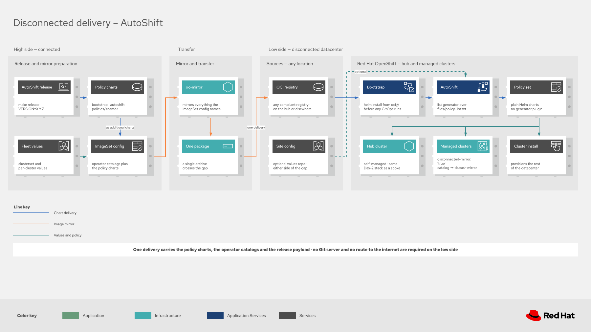

# AutoShift release and OCI guide

This guide covers how AutoShift releases are created, how OCI mode works, and how to manage OCI-based deployments. For step-by-step installation, see the [Quick Start Guide](quickstart.md).

## How OCI mode works

AutoShift has two deployment modes. Setting `autoshiftOciRepo` selects OCI; without it, policies come from git.

### Git mode (default)
```
AutoShift Chart (from Git)
    |
ApplicationSet with Git Generator
    |
Auto-discovers policies/ directories in Git
    |
Deploys each policy as an ArgoCD Application
```

### OCI mode (`autoshiftOciRepo` set)
```
AutoShift Chart (from OCI)
    |
ApplicationSet with List Generator
    |
Reads policy-list.txt (generated at release time; every policy is a Helm chart)
    |
Deploys each policy from the OCI registry (Helm chart or PolicyGenerator artifact)
```

The OCI chart includes a `files/policy-list.txt` that is **automatically generated during the release process** by discovering all policies in the `policies/` directory. No manual maintenance is required.

### Key differences

| Aspect | Git Mode | OCI Mode |
|--------|----------|----------|
| **Generator** | `git:` - auto-discovers `policies/{stable,certified,community}/*` | `list:` - reads `policy-list.txt` |
| **Source** | Git repository path | OCI chart reference |
| **Version** | Git branch/tag | Chart version (pinned) |
| **Dynamic** | Auto-discovers new policies | Fixed to released policies |
| **Use Case** | Development, customization | Production, version-pinned |

## OCI registry structure

When a release is created with `make release`, charts are published to the registry in this structure:

```
quay.io/autoshift/
├── bootstrap/
│   ├── openshift-gitops          # Bootstrap chart for GitOps operator
│   └── advanced-cluster-management  # Bootstrap chart for ACM operator
├── autoshift                      # Main chart (ApplicationSet)
└── policies/
    ├── openshift-gitops           # Policy: Helm chart (takes over GitOps)
    ├── advanced-cluster-management # Policy: PolicyGenerator (takes over ACM)
    ├── advanced-cluster-security  # Policy: PolicyGenerator
    └── ... (additional policies: mostly PolicyGenerator dirs, a few Helm charts)
```

All charts share the same version number, set during the release process.

## OCI configuration values

When deploying from OCI, two values control the behavior. These are set automatically by the `install-autoshift.sh` script generated during the release:

```yaml
# Where the policy charts are published, and the value that selects OCI mode.
# Change this if you release your own charts.
autoshiftOciRepo: oci://quay.io/autoshift/policies

# The release to deploy. Argo CD does not reliably track a mutable tag, so pin it.
# In an ArgoCD Application, inject it from the Application's own targetRevision:
#   parameters:
#     - name: autoshiftOciVersion
#       value: $ARGOCD_APP_SOURCE_TARGET_REVISION
autoshiftOciVersion: "0.0.5"
```

> [!NOTE]
> `autoshiftOciRegistry` was a separate boolean that selected the mode. It still works and still
> decides, but it is redundant now and should be deleted from your values.

## Overview

AutoShift releases consist of multiple Helm charts:
- **2 bootstrap charts**: `openshift-gitops`, `advanced-cluster-management`
- **1 main chart**: `autoshift` (ApplicationSet)
- **Policies**: Red Hat Advanced Cluster Management for Kubernetes policies for Day 2 operations (one per `policies/` subdirectory) — mostly PolicyGenerator directories, plus a few Helm charts (openshift-gitops, policy-foundation, cluster-labels, cluster-config-maps)

All artifacts are version-synchronized and published to an OCI registry. Released artifacts are completely self-contained with no Git repository access required at runtime.

## Prerequisites

### Required tools

```bash
# Helm 3.14+
helm version

# yq (YAML processor) 4.x
yq --version

# Git
git version

# Access to OCI registry
helm registry login <registry>
```

### Install yq

```bash
# macOS
brew install yq

# Linux
wget https://github.com/mikefarah/yq/releases/latest/download/yq_linux_amd64 -O /usr/local/bin/yq
chmod +x /usr/local/bin/yq

# Check installation
yq --version
```

## Release workflow

### 1. Prepare release

```bash
# View available Make targets
make help

# Discover charts (informational)
make discover

# Validate prerequisites
make validate
```

### 2. Create release

**For Testing (Release Candidate):**
```bash
# Uses default registry: quay.io/autoshift
make release VERSION=X.Y.Z-rc.1

# Or override with custom registry
make release VERSION=X.Y.Z-rc.1 REGISTRY=ghcr.io REGISTRY_NAMESPACE=myorg/autoshift
```

**For Production:**
```bash
# Uses default registry: quay.io/autoshift
make release VERSION=X.Y.Z

# Or override with custom registry
make release VERSION=X.Y.Z REGISTRY=ghcr.io REGISTRY_NAMESPACE=myorg/autoshift
```

**Dry Run (package without pushing):**
```bash
make release VERSION=X.Y.Z DRY_RUN=true
```

### 3. What happens during release

The `make release` command:

1. **Validates** - Checks tools and version format
2. **Updates versions** - Sets all charts to the same version
3. **Generates policy list** - Creates `policy-list.txt` with discovered policies
4. **Packages charts** - Creates `.tgz` files for all charts (includes policy-list.txt)
5. **Pushes to OCI** - Uploads charts to registry and tags as `latest`
6. **Generates artifacts** - Creates bootstrap installation scripts (`install-bootstrap.sh`, `install-autoshift.sh`)

### 4. Tag and release

```bash
# Create and push git tag
git add .
git commit -m "Release vX.Y.Z"
git tag vX.Y.Z
git push origin vX.Y.Z

# Create GitHub/GitLab release
# Upload artifacts from release-artifacts/ directory
```

## Makefile targets

```bash
make help                  # Show available targets
make discover              # List all discoverable charts
make validate              # Check required tools
make validate-version      # Validate VERSION format
make clean                 # Remove build artifacts
make update-versions       # Update all chart versions
make generate-policy-list  # Generate policy-list.txt for OCI mode
make package-charts        # Package all Helm charts
make push-charts           # Push charts to OCI registry
make generate-artifacts    # Generate bootstrap installation scripts
make release               # Full release process
make package-only          # Package without version updates
```

## Private registry authentication

If publishing to or deploying from a private OCI registry, configure credentials for ArgoCD:

```bash
# Create secret for OCI registry authentication
oc create secret docker-registry autoshift-oci-creds \
  --docker-server=quay.io \
  --docker-username=YOUR_USERNAME \
  --docker-password=YOUR_TOKEN \
  -n openshift-gitops

# Link to ArgoCD repo server (pulls Helm charts)
oc patch serviceaccount argocd-repo-server \
  -n openshift-gitops \
  --type='json' \
  -p='[{"op":"add","path":"/imagePullSecrets/-","value":{"name":"autoshift-oci-creds"}}]'

# Link to ApplicationSet controller (generates Applications)
oc patch serviceaccount argocd-applicationset-controller \
  -n openshift-gitops \
  --type='json' \
  -p='[{"op":"add","path":"/imagePullSecrets/-","value":{"name":"autoshift-oci-creds"}}]'

# Restart ArgoCD components to pick up credentials
oc rollout restart deployment/argocd-repo-server -n openshift-gitops
oc rollout restart deployment/argocd-applicationset-controller -n openshift-gitops
```

## Custom CA certificate

If your OCI registry uses a custom CA certificate (e.g., private registry with self-signed certs), ArgoCD's repo server needs access to the CA bundle to pull charts.

AutoShift handles this automatically when you set the `gitops-cluster-ca-bundle` label to `'true'` on a clusterset or cluster in your values files:

```yaml
hubClusterSets:
  hub:
    labels:
      gitops-cluster-ca-bundle: 'true'
```

Alternatively, you can enable it globally through the Helm value in `policies/stable/openshift-gitops/values.yaml`:

```yaml
gitops:
  repo:
    cluster_ca_bundle: true
```

The cluster label takes precedence over the Helm value when both are set.

When enabled, AutoShift:
1. Creates a `user-ca-bundle` ConfigMap in the ArgoCD namespace with the `config.openshift.io/inject-trusted-cabundle: "true"` label
2. OpenShift automatically populates that ConfigMap with the cluster's trusted CA certificates
3. Mounts the CA bundle into the ArgoCD repo server at `/etc/pki/ca-trust/extracted/pem/tls-ca-bundle.pem`

> [!NOTE]
> Your custom CA must already be added to the cluster's truststore through the [cluster-wide proxy](https://docs.redhat.com/en/documentation/openshift_container_platform/latest/html/networking/configuring-a-custom-pki) for the injection to include it.

## Disconnected / air-gapped environments

For disconnected environments, mirror the released artifacts to an internal registry.

[](diagrams/autoshift-oci-disconnected.drawio.svg)

> **One artifact type.** Every AutoShift policy ships as a **Helm chart** under `oci://<registry>/policies/<name>`
> — the hand-authored holdout charts and the PolicyGenerator policies (rendered to stock Helm charts in CI by
> `make render-policy-charts`). All are listed in `policy-list.txt`; `helm pull` works on every one. The
> policy-generator `ConfigManagementPlugin` is never used for OCI.

**Recommended — the `ImageSet` generator.** It discovers every AutoShift artifact (main chart, bootstrap charts,
all policy charts, plus the operator images each enabled policy needs) and emits an
`ImageSetConfiguration` for `oc mirror`:

```bash
make generate-imageset VERSION=X.Y.Z
# or call the script directly with your values files:
bash scripts/generate-imageset-config.sh \
  autoshift/values/global.yaml,autoshift/values/clustersets/hub.yaml \
  --output imageset-config.yaml --include-autoshift-charts

oc mirror --config imageset-config.yaml docker://registry.example.com
```

**Manual alternative**: copy the OCI artifacts registry-to-registry with `oras` (all policies are Helm charts):

```bash
VERSION="X.Y.Z"  # Replace with desired version
SRC="quay.io/autoshift"
DST="registry.example.com/autoshift"

# Main chart + bootstrap charts
for ref in autoshift bootstrap/openshift-gitops bootstrap/advanced-cluster-management; do
  oras cp ${SRC}/${ref}:${VERSION} ${DST}/${ref}:${VERSION}
done

# All policy charts (from policy-list.txt)
for policy in $(cat policy-list.txt); do
  oras cp ${SRC}/policies/${policy}:${VERSION} ${DST}/policies/${policy}:${VERSION}
done
```

Point `autoshiftOciRepo` at your internal registry. This is the one value to change when you
publish your own charts, whether to a mirror or to your own namespace:

```yaml
autoshiftOciRepo: oci://registry.example.com/autoshift/policies
```

`autoshiftOciVersion` needs no change if the Application injects it from its own `targetRevision`.

## Version management

### Upgrading

To upgrade or pin to a specific version, set `targetRevision` on the ArgoCD Application:

```bash
oc patch application.argoproj.io autoshift -n openshift-gitops \
  --type=merge \
  -p '{"spec":{"source":{"targetRevision":"X.Y.Z"}}}'
```


### Gradual rollouts

AutoShift supports deploying multiple versions side-by-side using Red Hat Advanced Cluster Management ClusterSets. See the [Gradual Rollout Guide](gradual-rollout.md) for details.

## Exclude policies

You can exclude specific policies from deployment in both Git and OCI modes:

```yaml
excludePolicies:
  - infra-nodes
  - worker-nodes
```

## Troubleshooting

### ArgoCD cannot pull charts from OCI registry

```bash
# Check if secret exists
oc get secret autoshift-oci-creds -n openshift-gitops

# Verify secret is linked to service accounts
oc get sa argocd-repo-server -n openshift-gitops -o yaml | grep -A2 imagePullSecrets
oc get sa argocd-applicationset-controller -n openshift-gitops -o yaml | grep -A2 imagePullSecrets

# Test credentials manually
helm registry login quay.io -u USERNAME -p TOKEN
helm pull oci://quay.io/autoshift/autoshift
```

### ApplicationSet not creating policy applications

```bash
# Check ApplicationSet status
oc get applicationset -n openshift-gitops -o yaml

# Check ApplicationSet controller logs
oc logs -n openshift-gitops deployment/argocd-applicationset-controller --tail=100

# Verify OCI mode is enabled
oc get application.argoproj.io autoshift -n openshift-gitops -o yaml | grep autoshiftOciRegistry
```

### Policy not found in registry

```bash
# PolicyGenerator policies (most policies) are OCI artifacts, not Helm charts — inspect with oras:
oras manifest fetch quay.io/autoshift/policies/advanced-cluster-security:latest

# Helm policies (cluster-labels, cluster-config-maps, openshift-gitops, policy-foundation) pull with helm:
helm pull oci://quay.io/autoshift/policies/openshift-gitops

# Verify all Applications are on the same version
oc get applications.argoproj.io -n openshift-gitops -o custom-columns=NAME:.metadata.name,REVISION:.spec.source.targetRevision | grep autoshift
```

## Support

- [Quick Start Guide](quickstart.md)
- [Gradual Rollout Guide](gradual-rollout.md)
- [Main README](../README.md)
