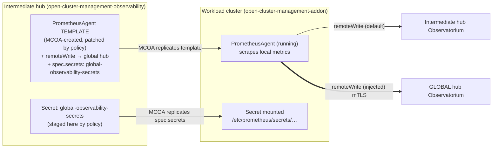
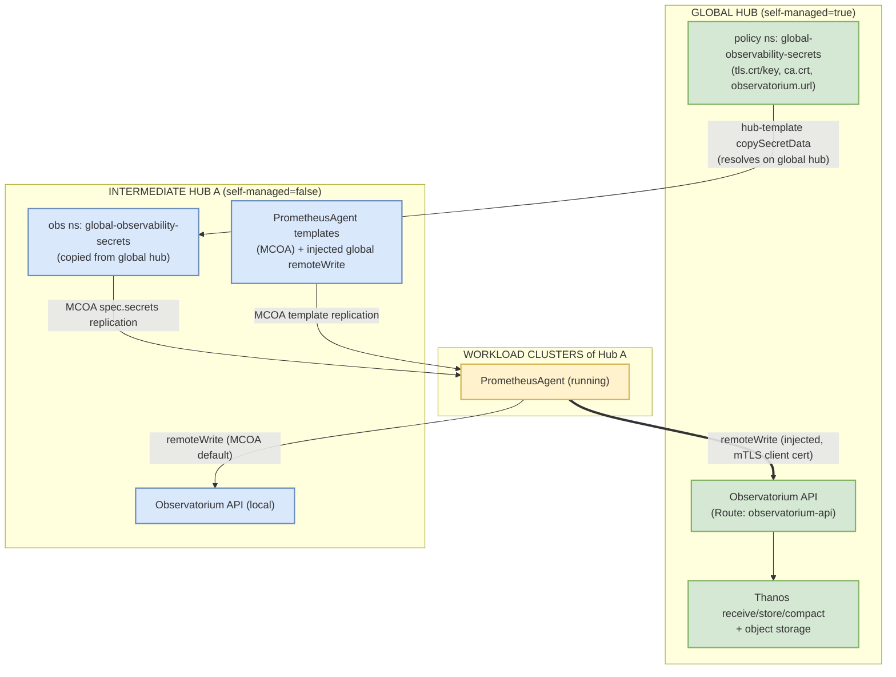
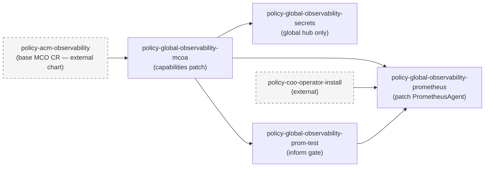
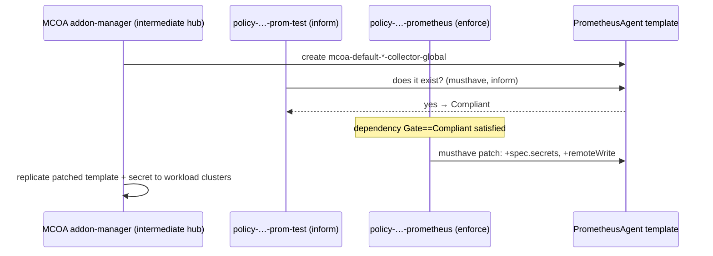
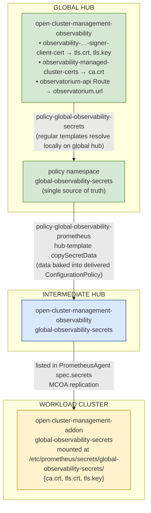

# Global Observability — Architecture

How AutoShift achieves a three-tier metrics rollup — **global hub → intermediate (regional) hubs → workload clusters** — using only ACM Policy, the MultiCluster Observability Addon (MCOA), and the `PrometheusAgent` template-replication mechanism, with no native hub-of-hubs observability feature in the product.

For labels, values, and configuration reference, see [README.md](README.md).

## 1. The problem

ACM MultiCluster Observability (MCO) is a single-tier design: one hub runs the MCO stack (Thanos, Observatorium API, Alertmanager, object storage), and each of its managed clusters runs a metrics collector that `remoteWrite`s into that hub's Observatorium. There is no native "forward one hub's observability up to another hub."

In a hub-of-hubs topology:

```
global hub
 ├── intermediate hub A   (itself an ACM hub with its own MCO + managed clusters)
 │     ├── workload cluster A1
 │     └── workload cluster A2
 └── intermediate hub B
       ├── workload cluster B1
       └── workload cluster B2
```

…each intermediate hub collects metrics from *its* workload clusters into *its own* Observatorium. The global hub has no visibility into workload-cluster metrics. We want a single global pane of glass covering every workload cluster, without a second collection agent per cluster and without modifying MCO.

## 2. The key insight — ride MCOA's template + secret replication

MCOA manages the lifecycle of `PrometheusAgent` (`monitoring.rhobs/v1alpha1`) resources:

1. **Template on the hub.** MCOA creates `PrometheusAgent` resources in the hub's `open-cluster-management-observability` namespace — templates defining the scrape config and `remoteWrite` targets for that hub's managed clusters. Names are deterministic: `mcoa-default-platform-metrics-collector-global`, `mcoa-default-user-workload-metrics-collector-global`.
2. **Replication to managed clusters.** MCOA copies each template down to every managed cluster's `open-cluster-management-addon` namespace, where it actually runs.
3. **Secret replication along with it.** Any secret named in the template's `spec.secrets` is automatically copied by MCOA from the hub's observability namespace to the managed cluster's addon namespace and mounted at `/etc/prometheus/secrets/<secret-name>/`.

**Therefore:** patch an intermediate hub's `PrometheusAgent` template to add (a) a `remoteWrite` entry pointing at the **global hub's** Observatorium and (b) the mTLS client-cert secret to authenticate to it, and MCOA carries both down to every workload cluster of that hub. Each workload cluster's agent then dual-writes:

- to its own intermediate hub's Observatorium (MCOA default — unchanged), and
- directly to the global hub's Observatorium (the injected `remoteWrite`).

Rollup metrics flow **workload cluster → global hub directly**; they do not hop through the intermediate hub's Thanos. The intermediate hub is only where the template is patched and the secret staged — MCOA's replication is the transport.



We don't build a forwarding pipeline; we ride MCOA's existing template+secret replication to push a second remote-write target all the way down to the leaf clusters.

## 3. Topology and roles

| Tier | Label profile | Runs | Role in rollup |
|------|---------------|------|----------------|
| **Global hub** | `global-observability: 'true'`, `self-managed: 'true'` | Full MCO stack + Observatorium — the central sink | Receives metrics from its own managed clusters (native MCOA) **and** from every workload cluster of every intermediate hub (injected remote-write) |
| **Intermediate hub** | `global-observability: 'true'`, `self-managed: 'false'` | Its own MCO stack + MCOA, manages workload clusters | Its `PrometheusAgent` templates are patched so its workload clusters also write up to the global hub |
| **Workload cluster** | (no labels needed) | The replicated `PrometheusAgent` (COO) | Dual-writes: local intermediate-hub Observatorium + global-hub Observatorium |

`self-managed` is the discriminator: the global hub manages itself (`'true'`); intermediate hubs are managed by the global hub (`'false'`). All placement and skip logic keys off it.

> **Why skip the rollup on the global hub?** Its own managed clusters already write into the global Observatorium through MCOA's default behavior. Injecting a "write to global hub" remote-write there would be a redundant self-loop, so the `*-prometheus` PolicySet placement excludes `self-managed: 'true'` entirely.

## 4. End-to-end data flow



Steps:

1. On the **global hub**, `policy-global-observability-secrets` assembles the coalesced secret `global-observability-secrets` in the **policy namespace**, composed field-by-field from MCO's own artifacts (regular templates resolving locally):
   - `tls.crt` / `tls.key` ← `observability-controller-open-cluster-management.io-observability-signer-client-cert`
   - `ca.crt` ← `observability-managed-cluster-certs`
   - `observatorium.url` ← `https://<observatorium-api Route host>/api/metrics/v1/default/api/v1/receive`
2. On each **intermediate hub**, `policy-global-observability-prometheus` uses a hub-template `copySecretData` (which resolves on the global hub, since the global hub manages the intermediate hub) to copy that secret into the intermediate hub's `open-cluster-management-observability` namespace.
3. The same policy patches the MCOA `PrometheusAgent` templates: adds the secret to `spec.secrets` and a `remoteWrite` entry whose URL is resolved at runtime via `fromSecret … "observatorium.url" | base64dec`, with `tlsConfig` pointing at the mounted cert paths. It also sets `scrapeInterval` and `logLevel` from rendered-config.
4. **MCOA** replicates the patched template and the secret to every workload cluster, mounting the certs at `/etc/prometheus/secrets/global-observability-secrets/`.
5. Each workload cluster's agent `remoteWrite`s directly to the global hub's Observatorium over mTLS (client cert issued by the global hub's observability signer), in addition to its local write.

## 5. Policy chain

This chart owns the global-hub-specific deltas on top of MCO. The base MCO lifecycle is owned by `policy-acm-observability` (advanced-cluster-management chart); this chart only patches on top.

| Policy | Placement (PolicySet) | Depends on | What it does |
|--------|-----------------------|------------|--------------|
| `policy-global-observability-mcoa` | `policyset-global-observability` — all global-obs hubs | `policy-acm-observability` | `musthave`-patches the `capabilities` block onto the existing `MultiClusterObservability` CR. Toggles from rendered-config, defaulting to all `"true"`. Conditional all the way down — if every toggle is `false`, no `capabilities` block is emitted. |
| `policy-global-observability-secrets` | `policyset-global-observability-secrets` — global hub only | `policy-global-observability-mcoa` | Assembles the coalesced rollup secret in the policy namespace — the source of truth that intermediate-hub hub-templates read via `copySecretData` |
| `policy-global-observability-prom-test` | `policyset-global-observability-prometheus` — intermediate hubs | `policy-global-observability-mcoa` | Inform-only gate: asserts the MCOA-created `PrometheusAgent` templates exist. Never creates or modifies them. |
| `policy-global-observability-prometheus` | `policyset-global-observability-prometheus` — intermediate hubs | `policy-global-observability-mcoa`, `policy-coo-operator-install`, `policy-global-observability-prom-test` | The core patcher: stages the rollup secret + any additional remote-write secrets into the obs namespace, then `musthave`-patches the `PrometheusAgent` templates with `spec.secrets` + `spec.remoteWrite` |



## 6. Why the exists-gate is necessary (subtle MCOA constraint)

**MCOA's addon-manager only replicates `PrometheusAgent` templates that MCOA itself created.** If ACM creates a `PrometheusAgent` in the hub observability namespace via policy, MCOA does not adopt it — it will not replicate that resource or its `spec.secrets`. The patch is inert.

Consequences:

1. **Patch, never create.** The patching ConfigurationPolicy uses `complianceType: musthave` with `recreateOption: IfRequired` against templates that already exist, merging our `remoteWrite`/`secrets` into MCOA's resource rather than owning it.
2. **Wait for MCOA to produce the templates first.** That is the entire purpose of `policy-global-observability-prom-test`: an inform-only ConfigurationPolicy asserting the named `PrometheusAgent` objects exist. The patcher lists it as a `Compliant` dependency, so it does not fire until MCOA has created its templates.



## 7. Secret lifecycle & mTLS trust

The rollup authenticates each workload cluster's agent to the global hub's Observatorium with a client cert issued by the global hub's observability signer. The coalesced secret travels three hops:



The injected `remoteWrite.tlsConfig` references the mount paths (`caFile`/`certFile`/`keyFile`); the `url` is resolved on the intermediate hub via `fromSecret … "observatorium.url" | base64dec`.

## 8. Additional remote-writes

Beyond the built-in rollup (hardcoded from `values.yaml → spokeAgent.globalHubRollup`, no config needed), `config.globalObservability.additionalRemoteWrites[]` lets a hub fan metrics out to extra targets. Each entry carries its own `url`, TLS file paths, optional `secretRef` (replicated from the global hub via hub-template `copySecretData`), and an `onSelfManagedHub` flag:

| `onSelfManagedHub` | Global hub | Intermediate hubs | Use case |
|--------------------|-----------|-------------------|----------|
| `false` (default) | skipped | emitted | targets only intermediate hubs should write to |
| `true` | emitted | emitted | external targets every hub should write to |

Emit condition in the template: `if not (and (eq $isSelfManaged "true") (not $onSelfManagedHub))` — emit unless we're on the global hub and the entry isn't flagged for it. (Note the `*-prometheus` PolicySet only places on intermediate hubs, so `onSelfManagedHub: true` entries take effect on the global hub only if placement is widened.)

## 9. Caveats

- **`secretNamespace` coupling.** `policy-global-observability-secrets` writes the coalesced secret into `.Values.policy_namespace`, computed by the ApplicationSet as `policies-<release-name>` (default `policies-autoshift`). The rollup's `copySecretData` reads from `spokeAgent.globalHubRollup.secretNamespace`, whose chart default is the literal `policies-autoshift`. These match only for the default release name — a differently-named AutoShift Application silently breaks the rollup secret copy unless `secretNamespace` is overridden.
- **Capability double-management.** `policy-acm-observability` also writes `spec.capabilities` on the same MCO CR when its `acm.observability.enableMCOA` flag is truthy. Both policies are additive `musthave` patches, so a `false` toggle here cannot remove a capability `enableMCOA` added. Leave `enableMCOA` unset/false so this chart is the sole capabilities manager.
- **Secret-name truncation.** MCOA translates each `spec.secrets` entry into a `secret-<name>` volume/mount name truncated to 63 chars (RFC 1123). If the cut lands on a non-alphanumeric character, the generated StatefulSet is invalid and the agent silently fails to roll out. Keep secret names short and alphanumeric-terminated.

## 10. Open questions (for ACM/MCO review)

1. **Is patching MCOA's templates a supported extension point?** We rely on MCOA tolerating a `musthave` merge that adds `remoteWrite`/`secrets`. Could a reconcile loop revert the patch, fighting the `enforce` ConfigurationPolicy?
2. **Is there a first-class hub-of-hubs rollup?** If MCO/MCOA gains a native multi-target feature, this chart is obsolete.
3. **mTLS identity at scale.** Every workload cluster presents the same global-hub-issued client cert. Is per-cluster identity preferred? Any `cluster` label collision concerns in received series?
4. **Direct leaf → global write vs. hub aggregation.** Every leaf writes straight to the global hub, bypassing intermediate Thanos. Right call at hundreds of clusters per hub?
5. **The exists-gate pattern.** Is there a cleaner readiness signal (condition/status field) than asserting object existence via an inform policy?

## Appendix: namespaces & resource names

| Thing | Value |
|-------|-------|
| Policy namespace | `policies-<release-name>` (`.Values.policy_namespace`, computed by the ApplicationSet; default release `autoshift` → `policies-autoshift`) |
| MCO observability namespace | `open-cluster-management-observability` |
| MCOA addon namespace (on managed clusters) | `open-cluster-management-addon` |
| Coalesced rollup secret | `global-observability-secrets` |
| Patched `PrometheusAgent` templates | `mcoa-default-platform-metrics-collector-global`, `mcoa-default-user-workload-metrics-collector-global` |
| Rollup remote-write entry name | `acm-global-observability` |
